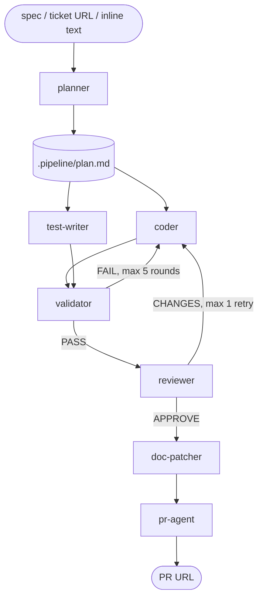

# automake

Turns a spec or ticket into reviewed, tested, documented code with a pull request.

## Pipeline

`dev-pipeline` orchestrates 8 agents in sequence, each in its own isolated context:

| Agent | Role |
|---|---|
| `planner` | Spec/ticket → structured requirements + architecture design |
| `coder` | Implements from the plan |
| `test-writer` | Writes tests from the plan (runs in parallel with `coder`) |
| `validator` | Runs the test suite, routes failures back to `coder`/`test-writer`/analyst |
| `reviewer` | Approve/request-changes verdict on code + tests |
| `doc-patcher` | Updates only docs directly affected by the changed files |
| `pr-agent` | Commits, pushes, opens the PR, then monitors and fixes CI |
| `ticket-analyst` | Used by `plan-tickets` (below), not the main pipeline |

State passes between agents as JSON handoff files and Markdown reports under `<worktree>/.pipeline/`, never as direct agent-to-agent calls — `dev-pipeline` is the sole orchestrator, and all work happens inside a dedicated git worktree.

## Other skills

- **`plan-tickets`** — turns raw input (GitHub/Linear/Jira issues, Google Docs, ad-hoc text) into structured ticket proposals via the `ticket-analyst` agent, then writes them back to the source system after user confirmation.
- **`create-pr`** — the standalone branch/worktree/push/PR skill that `pr-agent` builds on.

## Dependencies

- **`gh` CLI** — required by `create-pr`, `pr-agent`, and `plan-tickets` (GitHub issue read/write). No fallback if unavailable.
- **git worktrees** — `dev-pipeline` and `create-pr` isolate all changes in a worktree rather than the calling checkout.
- **MCP servers (optional)** — `plan-tickets` uses Linear/Jira/Google Drive MCP tools when configured; falls back to asking the user to paste content when not.
