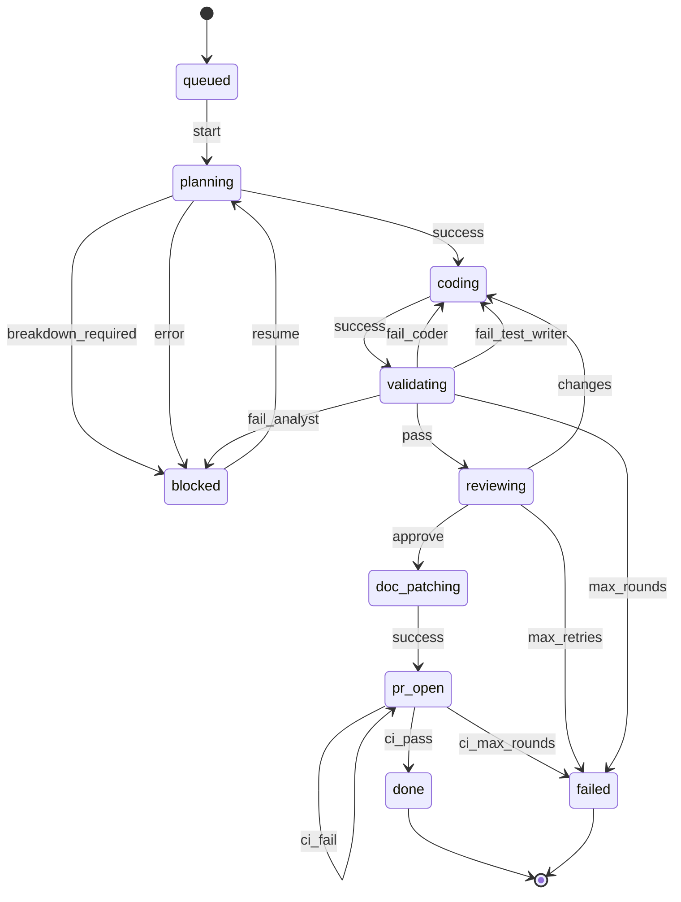

# automake

Turns a spec or ticket into reviewed, tested, documented code with a pull request. Progress is tracked durably in SQLite, and `issues.status` changes only through an enforced DFA — not through an LLM re-reading prose each time.

## Pipeline

`start` orchestrates 8 agents in sequence, each in its own isolated context. Every run is an `issues` row; every agent invocation is a `work` row; the topology config below is the sole source of legal `(status, event) → status` transitions:



Generated by `automake-db topology mermaid` against `automake/config/topology.default.json` — regenerate and re-paste here after editing the topology.

| State | Agent(s) | Role |
|---|---|---|
| `planning` | `planner` | Spec/ticket → structured requirements + architecture design |
| `coding` | `coder`, `test-writer` (parallel) | Implements from the plan / writes tests from the plan |
| `validating` | `validator` | Runs the test suite, routes failures back to `coder`/`test-writer`/analyst |
| `reviewing` | `reviewer` | Approve/request-changes verdict on code + tests |
| `doc_patching` | `doc-patcher` | Updates only docs directly affected by the changed files |
| `pr_open` | `pr-agent` | Commits, pushes, opens the PR, then monitors and fixes CI (up to 3 rounds, internally) |
| — | `ticket-analyst` | Used by `plan-tickets` (below), not the main pipeline |

Handoff JSON files and Markdown reports still pass between agents under `<worktree>/.pipeline/` — that's payload, not state. `start` is the sole orchestrator, all code changes happen inside a dedicated git worktree, and `issues.status`/`work` rows are the durable record of what ran and where.

## State: `automake-db`

A Go CLI, source at `automake/cli/automake-db`, is the only thing that writes to the database. It is installed once and then invoked by name (`automake-db <args>` — flags before positional args):

```
go install -C "$CLAUDE_PLUGIN_ROOT/cli/automake-db" .
```

`start` runs that itself when `which automake-db` comes up empty, so there is no manual setup step; `-C` is what lets it work from any working directory, since skills run with the CWD set to the *target* repo rather than the CLI's module. Re-run the same command after a plugin update to refresh a stale binary — it is a no-op when already current. The install directory (`$(go env GOBIN)`, else `$(go env GOPATH)/bin`) has to be on `PATH`.

It backs onto a single global, cross-repo SQLite file at `~/.claude/automake/state.db` (override with `$AUTOMAKE_DB`), so pipeline history and resumability work across every repo you use it in, not just one.

**Schema** (see `automake/cli/automake-db/db.go` for the exact DDL):

| Table | Purpose |
|---|---|
| `issues` | `id`, `status`, `description`, `ticket`, `created_at` — the abstract, repo-agnostic unit of work. A ticket can outlive or span repos, so no `repo`/`branch`/`worktree`/`PR` here. |
| `dependencies` | `id`, `dependency` — issue-to-issue blocking relationships. |
| `work` | `run`, `id`, `agent`, `context`, `started`, `finished`, `output`, `repo`, `branch`, `worktree`, `pr` — one row per agent invocation: where it ran and what it produced. |

**Commands**:

```
automake-db init
automake-db topology validate|show|mermaid [--config PATH]
automake-db issue create --description TEXT [--ticket TICKET] [--config PATH]
automake-db issue get <id>
automake-db issue list [--status STATE] [--ticket TICKET]
automake-db issue transition [--config PATH] <id> <event>
automake-db dep add <id> <dependency-id>
automake-db dep list <id>
automake-db work start --id ID --agent NAME --repo PATH [--branch B] [--worktree W] [--context TEXT]
automake-db work finish [--output TEXT] [--pr URL] <run>
automake-db work list --id ID
```

`issue transition` is the DFA enforcement point: it looks up `(current status, event)` in the topology's `transitions` map and rejects — nonzero exit, DB untouched — anything not defined there. Round/retry limits (`validating` max 5 rounds, `reviewing` max 1 retry i.e. 2 total attempts, `pr_open` max 3 CI rounds) are config-driven under `limits` and are *derived* from `work` history at transition time rather than stored as mutable counters, so they can't drift out of sync with what actually ran.

## Topology: configurable, extendable, still a DFA

The topology is JSON, not the mermaid diagram above — mermaid has no standard parser and no clean place to attach `agents`/`limits` metadata, so it's generated *from* the JSON for docs instead of hand-maintained. The CLI's resolution order is `--config PATH` flag → `$AUTOMAKE_TOPOLOGY` → the shipped default at `automake/config/topology.default.json`, located via `$CLAUDE_PLUGIN_ROOT` (with the build-time source directory as a fallback for `go run` and local development). Because the default is read from disk rather than compiled in, editing it takes effect immediately — no reinstall needed. Per-repo overrides are a layer above all of that: the CLI stays repo-agnostic, so it is the orchestrating skill that looks for `<repo_root>/.claude/automake/topology.json` and passes it in via `--config`.

Adding a pipeline step (say, a security-scan stage) means adding a state, its agent(s), and its transitions to the topology JSON — no CLI or skill changes required. `automake-db topology validate` checks the result is still a well-formed DFA: every transition target and `agents` key is a declared state, every `limits` entry references a real `(state, event)` pair and a real `on_exceed` event, and every non-terminal state is reachable from `initial` and has a way out. It also rejects the two ways a limit can silently do nothing: a limit on a state that declares no `agents` (the count it derives from `work` history would always be 0, so the cap could never fire) and a `cycle_agent` that isn't an agent of any state (never found in `work`, so the cycle boundary falls back to the issue's creation time and the limit counts globally instead of per cycle).

## Other skills

- **`plan-tickets`** — turns raw input (GitHub/Linear/Jira issues, Google Docs, ad-hoc text) into structured ticket proposals via the `ticket-analyst` agent, writes them back to the source system after user confirmation, and registers each as an `issues` row so `start` can find and resume it later by ticket.
- **`create-pr`** — the standalone branch/worktree/push/PR skill that `pr-agent` builds on. Deliberately DB-unaware — it's a generic utility used outside the full pipeline.

## Dependencies

- **`gh` CLI** — required by `create-pr`, `pr-agent`, and `plan-tickets` (GitHub issue read/write). No fallback if unavailable.
- **`go`** — required to install `automake-db` (one `go install`, run automatically on first use; no cgo, no C toolchain needed). Not needed again once the binary is on `PATH`.
- **git worktrees** — `start` and `create-pr` isolate all changes in a worktree rather than the calling checkout.
- **MCP servers (optional)** — `plan-tickets` uses Linear/Jira/Google Drive MCP tools when configured; falls back to asking the user to paste content when not.
