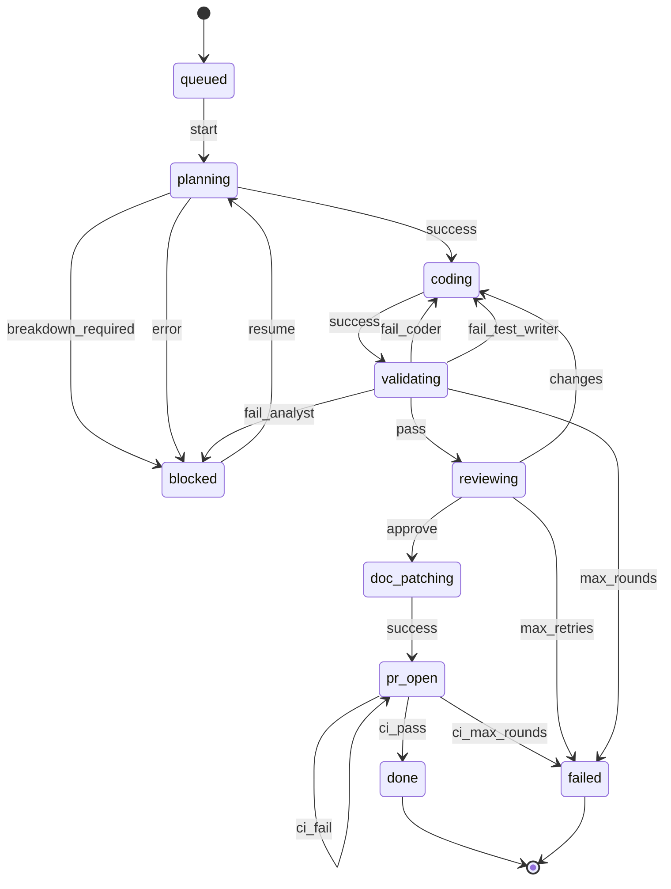

# automake

Turns a spec or ticket into reviewed, tested, documented code with a pull request. Progress is tracked durably in SQLite, and `issues.status` changes only through an enforced DFA — not through an LLM re-reading prose each time.

## Pipeline

`start` orchestrates 7 agents, each in its own isolated context — in sequence, except `coder` and `test-writer`, which run in parallel as one `coding` state. Every run is an `issues` row; every agent invocation is a `work` row; the topology config below is the sole source of legal `(status, event) → status` transitions:



Generated by `automake-db topology mermaid` against `automake/bin/automake-db/topology.default.json` — regenerate and re-paste here after editing the topology.

| State | Agent(s) | Role |
|---|---|---|
| `planning` | `planner` | Spec/ticket → structured requirements + architecture design |
| `coding` | `coder`, `test-writer` (parallel) | Implements from the plan / writes tests from the plan |
| `validating` | `validator` | Runs the test suite, routes failures back to `coder`/`test-writer`/analyst |
| `reviewing` | `reviewer` | Approve/request-changes verdict on code + tests |
| `doc_patching` | `doc-patcher` | Updates only docs directly affected by the changed files |
| `pr_open` | `pr-agent` | Commits, pushes, opens the PR, then monitors and fixes CI (up to 3 rounds, internally) |
| — | `ticket-analyst` | Used by `plan-tickets` (below), not the main pipeline |

Handoff JSON files and Markdown reports still pass between agents under `<worktree>/.pipeline/` — that's payload, not state. `start` is the sole orchestrator, all code changes happen inside a dedicated git worktree, and `issues.status`/`work` rows are the durable record of what ran and where.

## State: `automake-db`

A Go CLI at `automake/bin/automake-db` (built on cobra, so flags and positional args may be interspersed in any order) is the only thing that writes to the database. It backs onto a single global, cross-repo SQLite file at `~/.claude/automake/state.db` (override with `$AUTOMAKE_DB`), so pipeline history and resumability work across every repo you use it in, not just one.

**Build it, then invoke the binary.** The skills build it as their first step and then call it by path:

```
go build -C "$CLAUDE_PLUGIN_ROOT/bin/automake-db" -o "$CLAUDE_PLUGIN_ROOT/bin/automake-db/automake-db" .
"$CLAUDE_PLUGIN_ROOT/bin/automake-db/automake-db" <args>
```

A pipeline run makes roughly 15 CLI calls. `go run` recompiles and relinks on each one — about 2.5s a call even with a warm build cache, against 0.03s for the built binary — so one build up front replaces some 40s of pure overhead. `go build` is itself cached, so re-running it when nothing has changed costs a couple of seconds and keeps the binary current after a plugin update. The binary is gitignored and self-contained: `schema.sql` and the default topology are both compiled in, so it does not need its source tree at runtime and can be copied or installed anywhere.

**Schema** (see `automake/bin/automake-db/schema.sql` for the exact DDL, including indices):

| Table | Purpose |
|---|---|
| `issues` | `id`, `status`, `description`, `ticket`, `created_at` — the abstract, repo-agnostic unit of work. A ticket can outlive or span repos, so no `repo`/`branch`/`worktree`/`PR` here. |
| `dependencies` | `id`, `dependency` — issue-to-issue blocking relationships. |
| `work` | `id`, `issue_id`, `agent`, `context`, `started`, `finished`, `output`, `repo`, `branch`, `worktree`, `pr` — one row per agent invocation: where it ran and what it produced. |

**Commands**:

```
automake-db init
automake-db topology validate|show|mermaid [--config PATH]
automake-db issue create --description TEXT [--ticket TICKET] [--config PATH]
automake-db issue get <id>
automake-db issue list [--status STATE] [--ticket TICKET]
automake-db issue transition [--config PATH] <id> <event>
automake-db dep add <id> <dependency-id>
automake-db dep list <id>
automake-db work start --id ID --agent NAME --repo PATH [--branch B] [--worktree W] [--context TEXT]
automake-db work finish [--output TEXT] [--pr URL] <run>
automake-db work list --id ID
```

`issue transition` is the DFA enforcement point: it looks up `(current status, event)` in the topology's `transitions` map and rejects — nonzero exit, DB untouched — anything not defined there. The status write is a compare-and-swap against the status it read, so two runs racing on the same issue produce a visible conflict error rather than a silent last-writer-wins.

Round/retry limits are config-driven under `limits` and are *derived* from `work` history at transition time rather than stored as mutable counters, so they can't drift out of sync with what actually ran. That derivation is why the rule "every `issue transition` is preceded by `work start` for the agent whose output produced the event" is load-bearing and not just tidiness: with no work row to count, a limit has nothing to advance and the loop it guards is uncapped. The CLI warns on stderr when it sees that.

| Limit | Cap | Status |
|---|---|---|
| `validating.fail_coder` / `fail_test_writer` | 5 validator rounds since the last `reviewer` run | Enforced |
| `reviewing.changes` | 2 review attempts since the last `planner` run | Enforced |
| `pr_open.ci_fail` | 3 `pr-agent` rounds since the last `doc-patcher` run | Reserved — today's `pr-agent` self-manages its CI retries and reports one final verdict, so it never fires `ci_fail`. A future per-round variant must record a `work` row per round for this cap to bind. |

## Topology: configurable, extendable, still a DFA

The topology is JSON, not the mermaid diagram above — mermaid has no standard parser and no clean place to attach `agents`/`limits` metadata, so it's generated *from* the JSON for docs instead of hand-maintained.

Resolution order, as the CLI implements it: `--config PATH` flag → `$AUTOMAKE_TOPOLOGY` → the default compiled into the binary (`automake/bin/automake-db/topology.default.json`). There is deliberately no repo-root tier in the CLI — it stays repo-agnostic. A per-repo override lives at `<repo_root>/.claude/automake/topology.json`, and it is the orchestrating skill's job to notice one and pass it as `--config`, which means **a per-repo override outranks `$AUTOMAKE_TOPOLOGY`**, not the other way round.

To fork the default: `automake-db topology show > <repo_root>/.claude/automake/topology.json`, edit, and `automake-db topology validate --config <that path>`.

Adding a pipeline step (say, a security-scan stage) means adding a state, its agent(s), and its transitions to the topology JSON — no CLI or skill changes required. `automake-db topology validate` checks the result is still a well-formed DFA:

- every transition target is a declared state, and every `agents` key names one;
- every `limits` entry references a real `(state, event)` pair and a real `on_exceed` event, has a positive `max`, does not name the limited event as its own `on_exceed`, and sits on a state that actually has agents — the last two would each produce a limit that can never break the loop it guards;
- every non-terminal state is reachable from `initial`, has a way out, and can still reach a terminal state.

## Other skills

- **`plan-tickets`** — turns raw input (GitHub/Linear/Jira issues, Google Docs, ad-hoc text) into structured ticket proposals via the `ticket-analyst` agent, writes them back to the source system after user confirmation, and registers each as an `issues` row so `start` can find and resume it later by ticket.
- **`create-pr`** — the standalone branch/worktree/push/PR skill that `pr-agent` builds on. Deliberately DB-unaware — it's a generic utility used outside the full pipeline.

## Dependencies

- **`gh` CLI** — required by `create-pr`, `pr-agent`, and `plan-tickets` (GitHub issue read/write). No fallback if unavailable.
- **`go`** — required to build `automake-db`. The skills run `go build` themselves as a setup step, so there is nothing to install by hand; the plugin directory does need to be writable for the binary to land there. No cgo, no C toolchain needed.
- **git worktrees** — `start` and `create-pr` isolate all changes in a worktree rather than the calling checkout.
- **MCP servers (optional)** — `plan-tickets` uses Linear/Jira/Google Drive MCP tools when configured; falls back to asking the user to paste content when not.
