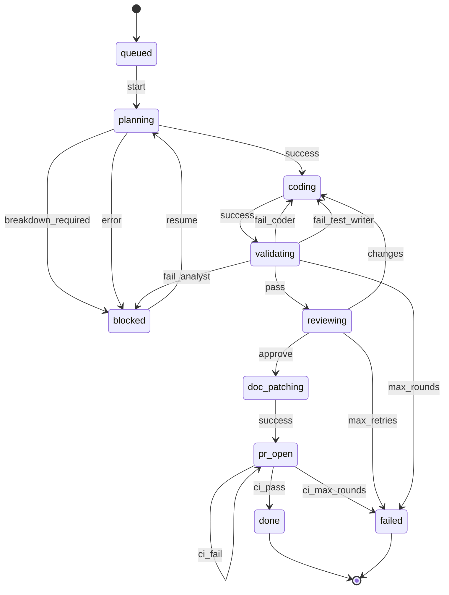

# Start

Orchestrate the full pipeline from technical specification to merged pull request. Every run is a durable `issues` row in the global SQLite state at `~/.claude/automake/state.db`; every agent invocation is a `work` row; `issues.status` only ever changes through `automake-db issue transition`, which enforces the configured topology as a DFA — a `(status, event)` pair not in the topology's transitions map is rejected outright, not just discouraged in prose.

```!
if [ -z "${CLAUDE_PLUGIN_ROOT:-}" ]; then
  echo "automake-db: BUILD FAILED — \$CLAUDE_PLUGIN_ROOT is unset/empty (likely a programmatic invocation that didn't set plugin env vars) — stop and show this to the user"
elif [ -x "$CLAUDE_PLUGIN_ROOT/cli/automake-db/automake-db" ]; then
  echo "automake-db: already built"
elif ! command -v go >/dev/null 2>&1; then
  echo "automake-db: BUILD FAILED — go not found on \$PATH — stop and show this to the user"
else
  go build -C "$CLAUDE_PLUGIN_ROOT/cli/automake-db" -o "$CLAUDE_PLUGIN_ROOT/cli/automake-db/automake-db" . \
    && echo "automake-db: built" || echo "automake-db: BUILD FAILED — stop and show this to the user"
fi
```

## Should this trigger?

Trigger automatically for:
- A feature or bugfix request with definable scope (the kind of thing that would naturally become a ticket)
- A request that references a ticket/issue URL or ID
- A change that will plausibly touch 2+ files, or introduces a new module/endpoint/component

Do **not** trigger — handle as a normal inline edit instead — for:
- A single-file, mechanically-scoped change (typo, rename, one-line tweak, config value change)
- Follow-up iteration on a diff already open in the current conversation
- Debugging/exploration where the user hasn't asked for a committed change yet

When genuinely unsure, err toward inline editing — spinning up a worktree and opening a draft PR for a one-line fix is worse than occasionally asking the user whether they wanted the full pipeline.

## Pipeline



Generated by `automake-db topology mermaid` against `automake/cli/automake-db/topology.default.json` — regenerate and re-paste after editing the topology, don't hand-edit this diagram.

| State | Agent(s) |
|---|---|
| `planning` | `planner` |
| `coding` | `coder`, `test-writer` (parallel) |
| `validating` | `validator` |
| `reviewing` | `reviewer` |
| `doc_patching` | `doc-patcher` |
| `pr_open` | `pr-agent` |

`ticket-analyst` belongs to `plan-tickets`, not this pipeline.

## The `automake-db` CLI

Every state change and every agent invocation goes through the `automake-db` binary, invoked by its full path:

```
"$CLAUDE_PLUGIN_ROOT/cli/automake-db/automake-db" <args>
```

The setup block at the top of this skill builds that binary before anything else runs, but only if it isn't already there — the pipeline makes ~15 calls per run, and re-invoking `go build` on every single one costs about 2.5s a call for no benefit. A plugin update lands in a new cache directory (its path is content-addressed), so there's no stale-binary case to worry about: a rebuild only happens the first time a given checkout runs. If the build fails, **stop and show the user** — every step below depends on it. Do not fall back to `go run`.

It is the only thing that writes `issues.status` — never update pipeline progress by editing files or by reasoning about it in prose. See `automake/README.md` for the full command reference. The commands used below:

- `automake-db issue list --ticket <ticket>` / `issue create --description TEXT --ticket TICKET` — resumability lookup and issue creation
- `automake-db issue get <id>` — current status
- `automake-db issue transition [--config PATH] <id> <event>` — the only way status changes
- `automake-db work start --id ID --agent NAME --repo PATH [--branch B] [--worktree W] [--context TEXT]` — call before every agent invocation; prints a run id
- `automake-db work finish [--output TEXT] [--pr URL] <run>` — call after every agent invocation
- `automake-db work list --id ID` — inspect prior runs (used for resumability)

If `<repo_root>/.claude/automake/topology.json` exists, pass `--config <that path>` to every `automake-db` call below; otherwise omit `--config` to use the shipped default.

If `issue transition` exits nonzero, **stop the pipeline and show the error to the user** — it means the event mapping below doesn't match reality, not a normal pipeline outcome.

---

## Steps

### 0. Setup

1. **Parse arguments**:
   - `$ARGUMENTS[0]` — ticket URL, file path, or inline description (required)
   - `$ARGUMENTS[1]` — branch name (optional; default derived below)

2. **Determine input source** — three modes:

   **Ticket URL mode**: `$ARGUMENTS[0]` is a URL.
   - `https://github.com/*/issues/*` → `gh issue view <number> --repo <org/repo> --json title,body,comments`
   - `https://linear.app/*` → fetch via Linear MCP if available; else stop and ask user to paste content
   - `*atlassian.net/browse/*` → fetch via Jira MCP if available; else stop and ask user to paste content
   - `ticket` = the URL itself; `spec_content` = fetched JSON/text
   - Default branch: derived from ticket ID or title (e.g. `feat/eng-123-add-dark-mode`)

   **File mode**: `$ARGUMENTS[0]` is path to existing file.
   - Verify readable; stop if not.
   - `ticket` = absolute path to the file; `spec_file` = `$ARGUMENTS[0]`
   - Default branch: `feat/<spec-filename-without-extension>`

   **Inline mode**: `$ARGUMENTS[0]` is neither URL nor existing file path (also applies when invoked from conversation context — use the user's request text).
   - `ticket` = null (no external reference); `spec_content` = the description text
   - Default branch: `feat/pipeline-<timestamp>` (e.g. `feat/pipeline-20260417`)

3. **Resolve `repo_root`**: `git rev-parse --show-toplevel` from the current directory.

4. **Check for a resumable issue** (skip if `ticket` is null — inline requests with no external reference always start fresh):
   ```
   "$CLAUDE_PLUGIN_ROOT/cli/automake-db/automake-db" issue list --ticket <ticket>
   ```
   If a result has a non-terminal `status` (not `done`/`failed`):
   - `issue_id` = its `id`; current status = its `status`
   - `"$CLAUDE_PLUGIN_ROOT/cli/automake-db/automake-db" work list --id <issue_id>` → take the most recent row's `repo`, `branch`, `worktree`
   - If `worktree` still exists on disk and matches `repo_root`, reuse it; otherwise recreate the worktree at that `branch` (following the worktree-workflow rule)
   - Skip to the step matching the resumed status (table below); use the most recent `output` for that state's agent as the handoff content where a prior step's output is needed (e.g. resuming at `coding` needs the `planner` row's `output` as `plan.md`)
   - **Resuming from `blocked`**: show the user why it was blocked (from the relevant agent's last report) and ask for clarification before calling `"$CLAUDE_PLUGIN_ROOT/cli/automake-db/automake-db" issue transition <issue_id> resume` and re-entering at Planner (step 1) with the clarification appended to the handoff.

   | Resumed status | Re-enter at |
   |---|---|
   | `queued` | Fire `issue transition <issue_id> start`, then step 1 |
   | `planning` | Step 1 |
   | `coding` | Step 2 |
   | `validating` | Step 3 |
   | `reviewing` | Step 4 |
   | `doc_patching` | Step 5 |
   | `pr_open` | Step 6 |

   `queued` is the common case when `plan-tickets` registered the ticket but no
   pipeline has run for it yet: the issue exists with zero `work` rows, so
   there is nothing to recover from `work list` — treat it as a fresh start
   (create the worktree in step 5 as if it were a new issue) that happens to
   reuse the existing `issue_id`.

   Otherwise (no resumable issue): create one —
   ```
   "$CLAUDE_PLUGIN_ROOT/cli/automake-db/automake-db" issue create --description "<one-line summary of the request>" --ticket <ticket or omit>
   ```
   `issue_id` = the printed id. Its status is now the topology's initial state (`queued`); immediately:
   ```
   "$CLAUDE_PLUGIN_ROOT/cli/automake-db/automake-db" issue transition <issue_id> start
   ```
   → status is now `planning`.

5. **Create git worktree** (new issues, and issues resumed from `queued`) following worktree-workflow rule (check existing worktrees first, reuse if found). Derive `<worktree_path>` from where worktree is placed.
   - Use `<worktree_path>` as `repo_root` in every downstream handoff.

6. **Set `pipeline_dir`** = `<worktree_path>/.pipeline`. Create directory now. (This still holds JSON handoff files and Markdown reports — payload between agents, not status; the DB tracks status and history, not the payload itself.)

---

### 1. Planner

Write `<pipeline_dir>/handoff_planner.json`:
```json
{
  "spec_file": "<spec_file or null>",
  "content": "<spec_content or null>",
  "repo_root": "<repo_root>"
}
```
```
run=$("$CLAUDE_PLUGIN_ROOT/cli/automake-db/automake-db" work start --id <issue_id> --agent planner --repo <repo_root> --branch <branch_name> --worktree <worktree_path> --context <pipeline_dir>/handoff_planner.json)
```
Call `planner` with `<pipeline_dir>/handoff_planner.json`. Write output to `<pipeline_dir>/plan.md`.
```
"$CLAUDE_PLUGIN_ROOT/cli/automake-db/automake-db" work finish --output <pipeline_dir>/plan.md $run
```

- Output is a normal requirements+architecture doc → `"$CLAUDE_PLUGIN_ROOT/cli/automake-db/automake-db" issue transition <issue_id> success` → step 2.
- Output is `ERROR`, or lists >3 open questions → `... issue transition <issue_id> error` → status is now `blocked`; show the questions/error to the user and stop (see resumption path in step 0.4).
- Output is `BREAKDOWN REQUIRED` → `... issue transition <issue_id> breakdown_required` → status is now `blocked`; show the suggested breakdown to the user and stop.

---

### 2. Coder + Test Writer (parallel, test-writer conditional on the planner's Test Strategy)

Read the `## Test Strategy` `Decision:` line from `<pipeline_dir>/plan.md`. It is `WRITE_TESTS` or `SKIP_TESTS`. **If the field is missing, malformed, or ambiguous, treat it as `WRITE_TESTS`** — never silently skip tests because the field couldn't be parsed.

Write `<pipeline_dir>/handoff_coder.json`:
```json
{
  "requirements_file": "<pipeline_dir>/plan.md",
  "architecture_file": "<pipeline_dir>/plan.md",
  "repo_root": "<repo_root>"
}
```

Start coder's run:
```
coder_run=$("$CLAUDE_PLUGIN_ROOT/cli/automake-db/automake-db" work start --id <issue_id> --agent coder --repo <repo_root> --branch <branch_name> --worktree <worktree_path> --context <pipeline_dir>/handoff_coder.json)
```

**If `WRITE_TESTS`** — write `<pipeline_dir>/handoff_test_writer.json`:
```json
{
  "requirements_file": "<pipeline_dir>/plan.md",
  "code_files": [],
  "repo_root": "<repo_root>"
}
```
and start test-writer's run *before* calling either agent, so both are in flight together:
```
testwriter_run=$("$CLAUDE_PLUGIN_ROOT/cli/automake-db/automake-db" work start --id <issue_id> --agent test-writer --repo <repo_root> --branch <branch_name> --worktree <worktree_path> --context <pipeline_dir>/handoff_test_writer.json)
```
Call `coder` and `test-writer` simultaneously. Save coder's file list as `code_files`; test-writer's list as `test_files` and notes as `validator_notes`.
```
"$CLAUDE_PLUGIN_ROOT/cli/automake-db/automake-db" work finish --output "<coder's Files Written/Modified summary>" $coder_run
"$CLAUDE_PLUGIN_ROOT/cli/automake-db/automake-db" work finish --output "<test-writer's Test Files Written summary>" $testwriter_run
```

**If `SKIP_TESTS`** — do not start or call test-writer at all (no `work start` row for an agent that didn't run). Call only `coder`. Set `test_files = []` and `validator_notes` to the planner's Test Strategy `Reasoning:` line verbatim, so the validator and reviewer see *why* there are no tests instead of guessing.
```
"$CLAUDE_PLUGIN_ROOT/cli/automake-db/automake-db" work finish --output "<coder's Files Written/Modified summary>" $coder_run
```

Once coder (and test-writer, if it ran) finish (join point — `coding` is one state covering both agents, whether or not test-writer participated this round):
```
"$CLAUDE_PLUGIN_ROOT/cli/automake-db/automake-db" issue transition <issue_id> success
```
→ step 3. (Either agent emitting `ERROR` is not a DFA event — stop and show the error per the Rules below, same as today.)

---

### 3. Validator loop

Write `<pipeline_dir>/handoff_validator.json`:
```json
{
  "test_files": <test_files list>,
  "repo_root": "<repo_root>",
  "validator_notes": "<notes from test-writer>"
}
```
```
run=$("$CLAUDE_PLUGIN_ROOT/cli/automake-db/automake-db" work start --id <issue_id> --agent validator --repo <repo_root> --branch <branch_name> --worktree <worktree_path> --context <pipeline_dir>/handoff_validator.json)
```
Call `validator`; write output to `<pipeline_dir>/validator_report.md`.
```
"$CLAUDE_PLUGIN_ROOT/cli/automake-db/automake-db" work finish --output <pipeline_dir>/validator_report.md $run
```

- **PASS** → `issue transition <issue_id> pass` → step 4.
- **FAIL, routed to `coder`** → `issue transition <issue_id> fail_coder`. If the CLI reports "limit reached ... auto-routing via max_rounds", status is now `failed` — stop, show the report (this is the 5-round cap firing). Otherwise status is `coding` — add `failure_details` to the coder handoff, re-run step 2's `work start`/coder/`work finish` sequence for the coder only (test-writer isn't re-run unless also routed), then **fire `issue transition <issue_id> success` again** to return the issue to `validating` before re-entering step 3.
- **FAIL, routed to `test-writer`** → `issue transition <issue_id> fail_test_writer`, same round-limit behavior, re-run test-writer only, then fire `issue transition <issue_id> success` again before re-entering step 3.

> Every retry round goes back through `coding → validating`. Re-entering step 3
> while the issue is still in `coding` makes the next `pass`/`fail_*` an illegal
> transition, which the CLI rejects and the rules below turn into a hard stop.
- **FAIL, routed to `analyst`** (ambiguous requirements) → `issue transition <issue_id> fail_analyst` → status is `blocked` — stop and ask the user (see step 0.4 resumption path).

---

### 4. Reviewer

Write `<pipeline_dir>/handoff_reviewer.json`:
```json
{
  "requirements_file": "<pipeline_dir>/plan.md",
  "architecture_file": "<pipeline_dir>/plan.md",
  "code_files": <code_files>,
  "test_files": <test_files>,
  "validator_report": "<pipeline_dir>/validator_report.md"
}
```
```
run=$("$CLAUDE_PLUGIN_ROOT/cli/automake-db/automake-db" work start --id <issue_id> --agent reviewer --repo <repo_root> --branch <branch_name> --worktree <worktree_path> --context <pipeline_dir>/handoff_reviewer.json)
```
Call `reviewer`; write output to `<pipeline_dir>/reviewer_report.md`.
```
"$CLAUDE_PLUGIN_ROOT/cli/automake-db/automake-db" work finish --output <pipeline_dir>/reviewer_report.md $run
```

- **APPROVE** → `issue transition <issue_id> approve` → step 5.
- **REQUEST CHANGES** → `issue transition <issue_id> changes`. If the CLI reports the limit auto-routed to `max_retries`, status is now `failed` — stop, show the report (this is the "2 total review attempts" cap firing). Otherwise status is `coding` — send BLOCKING issues to `coder` (add as `review_issues`) and return to step 2.

---

### 5. Doc Patcher

Write `<pipeline_dir>/handoff_doc_patcher.json`:
```json
{
  "code_files": <code_files>,
  "repo_root": "<repo_root>"
}
```
```
run=$("$CLAUDE_PLUGIN_ROOT/cli/automake-db/automake-db" work start --id <issue_id> --agent doc-patcher --repo <repo_root> --branch <branch_name> --worktree <worktree_path> --context <pipeline_dir>/handoff_doc_patcher.json)
```
Call `doc-patcher`; save updated file list as `doc_files`.
```
"$CLAUDE_PLUGIN_ROOT/cli/automake-db/automake-db" work finish --output "<Docs Updated summary>" $run
"$CLAUDE_PLUGIN_ROOT/cli/automake-db/automake-db" issue transition <issue_id> success
```
→ step 6.

---

### 6. PR Agent

Write `<pipeline_dir>/handoff_pr_agent.json`:
```json
{
  "repo_root": "<worktree_path>",
  "branch_name": "<branch_name>",
  "worktree_path": "<worktree_path>",
  "code_files": <code_files>,
  "test_files": <test_files>,
  "doc_files": <doc_files>,
  "artifact_dir": "<pipeline_dir>",
  "requirements_file": "<pipeline_dir>/plan.md",
  "reviewer_report": "<pipeline_dir>/reviewer_report.md",
  "reviewer_verdict": "APPROVE"
}
```
```
run=$("$CLAUDE_PLUGIN_ROOT/cli/automake-db/automake-db" work start --id <issue_id> --agent pr-agent --repo <repo_root> --branch <branch_name> --worktree <worktree_path> --context <pipeline_dir>/handoff_pr_agent.json)
```
Call `pr-agent` (handles cleanup, commit, push, PR creation, and — internally, per its own contract — up to 3 CI fix rounds before returning a single final verdict).
```
"$CLAUDE_PLUGIN_ROOT/cli/automake-db/automake-db" work finish $run --output "<pr-agent's report>" --pr <PR URL>
```
Put `$run` before the flags here, and **omit `--pr` entirely when pr-agent produced no PR URL** — a bare trailing `--pr` swallows `$run` as its value, and the command then fails for want of a positional argument, losing the finish record.

- **Status: SUCCESS** → `issue transition <issue_id> ci_pass` → status is `done`. Report the PR URL to the user.
- **Status: FAIL** → `issue transition <issue_id> ci_max_rounds` → status is `failed` (pr-agent already exhausted its internal retry budget before reporting FAIL, so this always maps straight to the terminal failure event, not the `ci_fail` self-loop — the loop stays available in the topology for a future pr-agent variant that reports per-round instead of self-managing retries — such a variant must record a `work start` row per CI round, or the `pr_open.ci_fail` limit has nothing to count and the loop is uncapped). Stop, show the last CI log.

After PR created (or on early stop), remove worktree:
```
git worktree remove --force <worktree_path>
```

---

## Error Handling

| Situation | Action |
|---|---|
| Spec file not found | Stop, tell user |
| No argument and no conversation context | Stop, ask user |
| Worktree creation fails | Stop, tell user |
| `issue transition` exits nonzero | Stop, show the CLI's stderr — this is an event-mapping bug, not a normal outcome |
| Planner emits `ERROR` or >3 open questions | `issue transition <id> error` → `blocked`; show to user |
| Planner emits `BREAKDOWN REQUIRED` | `issue transition <id> breakdown_required` → `blocked`; show breakdown |
| Validator fails 5 rounds | Auto-routed to `failed` by the CLI; show last report |
| Reviewer requests changes twice | Auto-routed to `failed` by the CLI; show review |
| pr-agent reports FAIL | `issue transition <id> ci_max_rounds` → `failed`; show CI log |
| Any agent emits `ERROR` outside the above | Stop, show error (not a DFA event — this is a bug in the agent call, not a pipeline outcome) |

## Rules

- Never commit `<pipeline_dir>/` artifacts
- Never push to `main` or `master`
- Always run coder and test-writer in parallel (step 2)
- Show progress after each major step
- Every `issue transition` call must be preceded by the `work start`/`work finish` pair for the agent whose output produced the event — the CLI's round-limit derivation depends on that history existing
