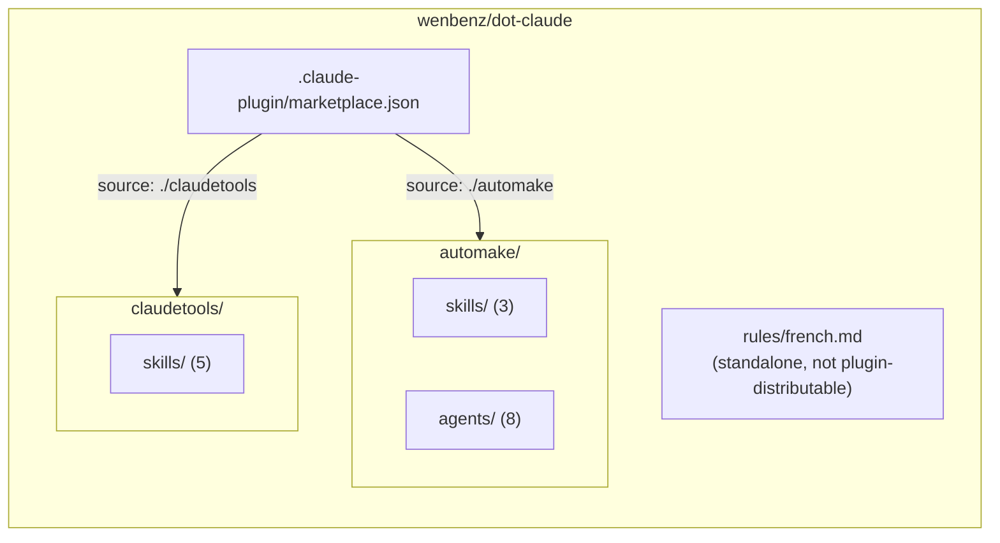

# Codebase Overview

## Purpose

Personal Claude Code plugin marketplace (`ben9`, hosted at `wenbenz/dot-claude`). Packages a spec-to-PR development pipeline and a set of meta/authoring tools as installable plugins, plus one standalone rule that isn't plugin-distributable.

## Architecture

A `.claude-plugin/marketplace.json` catalog lists two plugins, each in its own top-level directory so Claude Code's default `skills/`/`agents/` scanning stays scoped to that plugin only:

Each plugin directory is self-contained (no shared root) — an earlier layout shared one `skills/`/`agents/` root across plugins with marketplace-entry path overrides, but the `agents` field has no equivalent to the `skills` field's marketplace-root exception, so plugins with no agents silently inherited the full shared `agents/` folder. Per-plugin directories avoid that entirely.

## Directory Structure

| Path | Purpose |
|---|---|
| `.claude-plugin/marketplace.json` | Marketplace catalog: name (`ben9`), owner, and the two plugin entries |
| `automake/` | Spec/ticket-to-PR pipeline — see [automake/README.md](../automake/README.md) for the agent pipeline and data flow |
| `claudetools/skills/` | `create-agent`, `create-skill`, `create-rule`, `update-docs`, `bungafy` |
| `rules/` | `french.md` — unconditional rule, loaded into every session; not part of either plugin |

## Key Components

**automake** — turns a spec or ticket into a reviewed, tested, documented PR via 8 orchestrated agents. See [automake/README.md](../automake/README.md) for the pipeline diagram, agent roles, and dependencies.

**claudetools** — authoring and maintenance tools, no agents:
- `create-agent` / `create-skill` / `create-rule` scaffold new pipeline agents, skills, and `.claude/rules/` files respectively, each from a template.
- `update-docs` is the skill that generated this file — scans the repo and keeps `README.md`, `CLAUDE.md`, and `docs/*.md` in sync with the code.
- `bungafy` compresses markdown files (drops filler words, shortens phrases, collapses redundant structure) to cut token count without losing meaning.
