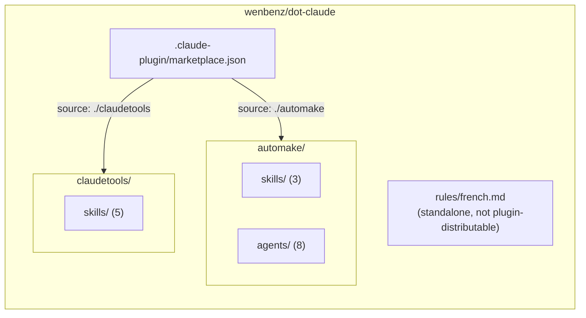
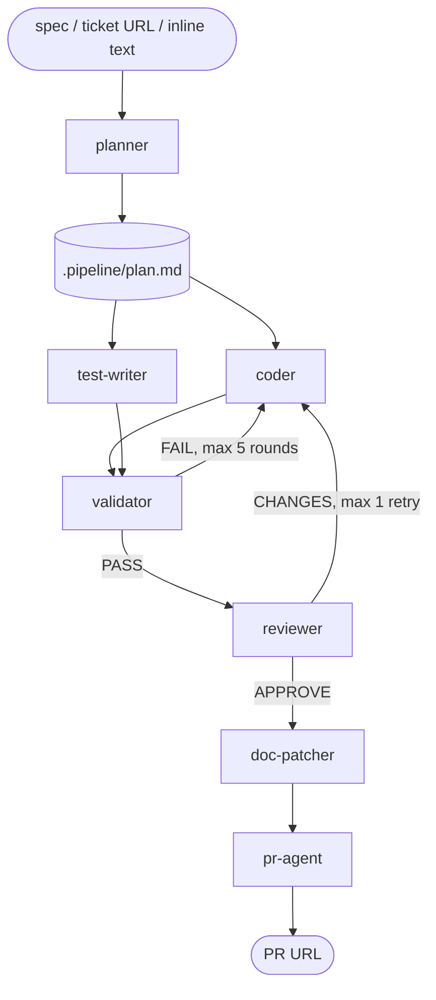

# Codebase Overview

## Purpose

Personal Claude Code plugin marketplace (`ben9`, hosted at `wenbenz/dot-claude`). Packages a spec-to-PR development pipeline and a set of meta/authoring tools as installable plugins, plus one standalone rule that isn't plugin-distributable.

## Architecture

A `.claude-plugin/marketplace.json` catalog lists two plugins, each in its own top-level directory so Claude Code's default `skills/`/`agents/` scanning stays scoped to that plugin only:

Each plugin directory is self-contained (no shared root) — an earlier layout shared one `skills/`/`agents/` root across plugins with marketplace-entry path overrides, but the `agents` field has no equivalent to the `skills` field's marketplace-root exception, so plugins with no agents silently inherited the full shared `agents/` folder. Per-plugin directories avoid that entirely.

## Directory Structure

| Path | Purpose |
|---|---|
| `.claude-plugin/marketplace.json` | Marketplace catalog: name (`ben9`), owner, and the two plugin entries |
| `automake/skills/` | `dev-pipeline`, `create-pr`, `plan-tickets` |
| `automake/agents/` | The 8 agents the dev pipeline orchestrates |
| `claudetools/skills/` | `create-agent`, `create-skill`, `create-rule`, `update-docs`, `bungafy` |
| `rules/` | `french.md` — unconditional rule, loaded into every session; not part of either plugin |

## Key Components

**automake** — turns a spec or ticket into a reviewed, tested, documented PR.
- `dev-pipeline` skill orchestrates 8 agents in sequence: `planner` → `coder` + `test-writer` (parallel) → `validator` (loop, max 5 rounds) → `reviewer` → `doc-patcher` → `pr-agent`. Agents hand off state via JSON files in a `.pipeline/` directory inside a dedicated git worktree.
- `plan-tickets` turns raw input (GitHub/Linear/Jira issues, Google Docs, ad-hoc text) into structured ticket proposals via the `ticket-analyst` agent, then writes them back to the source system after user confirmation.
- `create-pr` is the standalone branch/worktree/push/PR skill that `dev-pipeline`'s `pr-agent` step builds on.

**claudetools** — authoring and maintenance tools with no agents.
- `create-agent` / `create-skill` / `create-rule` scaffold new pipeline agents, skills, and `.claude/rules/` files respectively, each from a template.
- `update-docs` is the skill that generated this file — scans the repo and keeps `README.md`, `CLAUDE.md`, and `docs/*.md` in sync with the code.
- `bungafy` compresses markdown files (drops filler words, shortens phrases, collapses redundant structure) to cut token count without losing meaning.

## Data Flow

The dev pipeline is the only multi-step data flow in this repo:

State passes between agents as JSON handoff files and Markdown reports under `<worktree>/.pipeline/`, never as direct agent-to-agent calls — the `dev-pipeline` skill is the sole orchestrator.

## Dependencies

- **`gh` CLI** — required by `create-pr`, `dev-pipeline` (via `pr-agent`), and `plan-tickets` (GitHub issue read/write). No fallback if unavailable.
- **git worktrees** — `dev-pipeline` and `create-pr` isolate all changes in a worktree rather than the calling checkout.
- **MCP servers (optional)** — `plan-tickets` uses Linear/Jira/Google Drive MCP tools when configured; falls back to asking the user to paste content when not.
