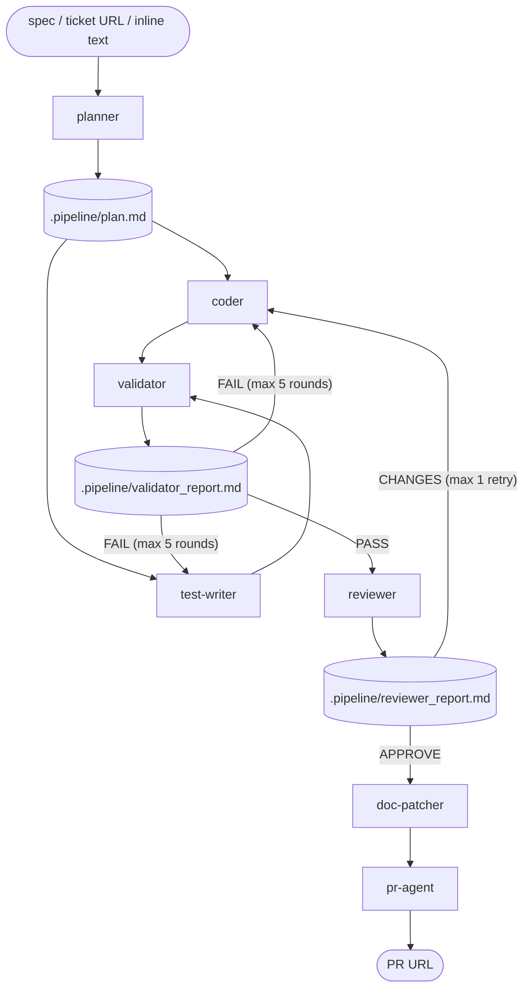

# Dev Pipeline

Orchestrate the full pipeline from technical specification to merged pull request.

```!
echo "Repo root: $(git rev-parse --show-toplevel 2>/dev/null || echo '(not a git repo)')"
echo "Branch:    $(git branch --show-current 2>/dev/null || echo '(unknown)')"
```

## Pipeline Overview



## Handoff convention

Before calling each agent, write a JSON handoff file to `<pipeline_dir>/`. The agent reads this file from the absolute path passed as its argument. Each agent also writes its report to `<pipeline_dir>/<agent>_report.md` for use by downstream agents.

---

## Steps

### 0. Setup

1. **Parse arguments**:
   - `$ARGUMENTS[0]` — ticket URL, file path, or inline description (required)
   - `$ARGUMENTS[1]` — branch name (optional; default derived below)

2. **Determine input source** — three modes:

   **Ticket URL mode**: `$ARGUMENTS[0]` is a URL.
   - `https://github.com/*/issues/*` → fetch with `gh issue view <number> --repo <org/repo> --json title,body,comments`
   - `https://linear.app/*` → fetch via Linear MCP if available; otherwise stop and ask the user to paste the content
   - `*atlassian.net/browse/*` → fetch via Jira MCP if available; otherwise stop and ask the user to paste the content
   - Write fetched content to `<pipeline_dir>/spec.md`
   - `spec_content` = fetched JSON/text; `spec_file` = `<pipeline_dir>/spec.md`
   - Default branch name: derived from ticket ID or title (e.g. `feat/eng-123-add-dark-mode`)

   **File mode**: `$ARGUMENTS[0]` is a path to an existing file.
   - Verify the file exists and is readable. Stop if not.
   - `spec_file` = `$ARGUMENTS[0]`; `spec_content` = null
   - Default branch name: `feat/<spec-filename-without-extension>`

   **Inline mode**: `$ARGUMENTS[0]` is neither a URL nor an existing file path.
   - Also applies when the pipeline is invoked from conversation context (no explicit argument) — use the user's request text.
   - Write the description to `<pipeline_dir>/spec.md`
   - `spec_file` = `<pipeline_dir>/spec.md`; `spec_content` = null
   - Default branch name: `feat/pipeline-<timestamp>` (e.g. `feat/pipeline-20260417`)

3. **Create a git worktree** for the branch:
   - Worktree path: `<repo_root>/.worktrees/<branch-name>`
   - Run: `git worktree add -b <branch_name> <worktree_path>`
   - Use `<worktree_path>` as `repo_root` in every downstream handoff.

4. **Set `pipeline_dir`** = `<worktree_path>/.pipeline` — use this absolute path for every artifact below. This isolates each pipeline run to its own worktree and allows concurrent runs without conflicts.

   Create the directory now. Also ensure `<repo_root>/.worktrees/` exists (create if needed).

---

### 1. Planner

Write `<pipeline_dir>/handoff_planner.json`:
```json
{
  "spec_file": "<spec_file or null>",
  "content": "<spec_content or null>",
  "repo_root": "<repo_root>"
}
```
Call the `planner` agent with `<pipeline_dir>/handoff_planner.json`. Write its output to `<pipeline_dir>/plan.md`.

**Stop if** the planner emits:
- an `ERROR` — show it to the user
- more than 3 open questions — show them and ask for clarification
- `BREAKDOWN REQUIRED` — show the suggested breakdown and ask the user to split the task before re-running

---

### 2. Coder + Test Writer (parallel)

Write `<pipeline_dir>/handoff_coder.json`:
```json
{
  "requirements_file": "<pipeline_dir>/plan.md",
  "architecture_file": "<pipeline_dir>/plan.md",
  "repo_root": "<repo_root>"
}
```

Write `<pipeline_dir>/handoff_test_writer.json`:
```json
{
  "requirements_file": "<pipeline_dir>/plan.md",
  "code_files": [],
  "repo_root": "<repo_root>"
}
```

Call `coder` with `<pipeline_dir>/handoff_coder.json` and `test-writer` with `<pipeline_dir>/handoff_test_writer.json` **simultaneously**. Wait for both.

- Save coder's returned file list as `code_files`.
- Save test-writer's returned file list as `test_files` and its notes as `validator_notes`.

---

### 3. Validator loop (max 5 rounds)

Write `<pipeline_dir>/handoff_validator.json`:
```json
{
  "test_files": <test_files list>,
  "repo_root": "<repo_root>",
  "validator_notes": "<notes from test-writer>"
}
```
Call `validator` with `<pipeline_dir>/handoff_validator.json`. Write its output to `<pipeline_dir>/validator_report.md`.

- **If PASS** → proceed to step 4.
- **If FAIL** → read the routing summary:
  - Routed to `coder` → add `failure_details` to `<pipeline_dir>/handoff_coder.json`, call `coder` again
  - Routed to `test-writer` → add `failure_details` to `<pipeline_dir>/handoff_test_writer.json`, call `test-writer` again
  - Routed to `analyst` → **stop and ask the user** to clarify the requirement
  - After fixes, re-run `validator`
- **After 5 failed rounds** → stop and show `<pipeline_dir>/validator_report.md` to the user.

---

### 4. Reviewer

Write `<pipeline_dir>/handoff_reviewer.json`:
```json
{
  "requirements_file": "<pipeline_dir>/plan.md",
  "architecture_file": "<pipeline_dir>/plan.md",
  "code_files": <code_files>,
  "test_files": <test_files>,
  "validator_report": "<pipeline_dir>/validator_report.md"
}
```
Call `reviewer` with `<pipeline_dir>/handoff_reviewer.json`. Write its output to `<pipeline_dir>/reviewer_report.md`.

- **If APPROVE** → proceed to step 5.
- **If REQUEST CHANGES** → send BLOCKING issues back to `coder` (add as `review_issues` in handoff), reset validator round counter, return to step 3. Maximum **1 retry** — stop and show the report if still failing.

---

### 5. Doc Patcher

Write `<pipeline_dir>/handoff_doc_patcher.json`:
```json
{
  "code_files": <code_files>,
  "repo_root": "<repo_root>"
}
```
Call `doc-patcher` with `<pipeline_dir>/handoff_doc_patcher.json`. Save its list of updated files as `doc_files`.

---

### 6. PR Agent

Write `<pipeline_dir>/handoff_pr_agent.json`:
```json
{
  "repo_root": "<worktree_path>",
  "branch_name": "<branch_name>",
  "worktree_path": "<worktree_path>",
  "code_files": <code_files>,
  "test_files": <test_files>,
  "doc_files": <doc_files>,
  "artifact_dir": "<pipeline_dir>",
  "requirements_file": "<pipeline_dir>/plan.md",
  "reviewer_report": "<pipeline_dir>/reviewer_report.md",
  "reviewer_verdict": "APPROVE"
}
```

Call `pr-agent` with `<pipeline_dir>/handoff_pr_agent.json`. The pr-agent handles: reading PR description content, cleanup of `<pipeline_dir>`, commit, push, PR creation, and CI monitoring.

Report the PR URL to the user when done.

After the PR is created (or if the pipeline is stopped early due to an error), remove the worktree:
```
git worktree remove --force <worktree_path>
```

---

## Error Handling

| Situation | Action |
|---|---|
| File mode: spec file not found | Stop immediately, tell the user |
| Inline mode: no argument and no conversation context | Stop, ask the user what to build |
| Worktree creation fails | Stop, tell the user (branch may already exist) |
| Planner finds >3 open questions | Stop, show the questions to the user |
| Planner finds >3 requirements | Stop, show suggested breakdown to the user |
| Validator fails 5 times | Stop, show last report to the user |
| Reviewer requests changes twice | Stop, show review to the user |
| CI fails 3 times | Stop, show CI log to the user |
| Any agent emits ERROR | Stop, show the error to the user |

## Rules

- Never commit `<pipeline_dir>/` artifacts to the repo
- Never push to `main` or `master`
- Always run coder and test-writer in parallel (step 2)
- Show progress to the user after each major step
- Validator round counter resets per reviewer cycle, not globally
